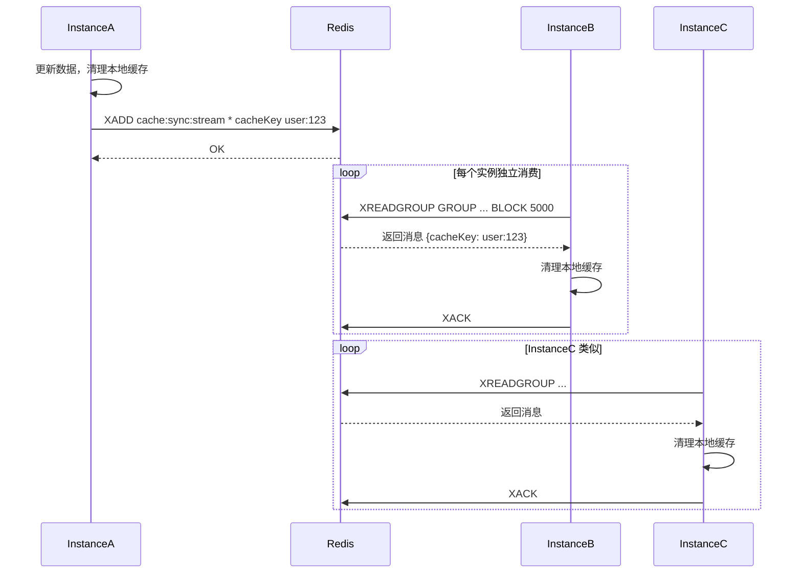

# 基于 Redis Streams 的多实例本地缓存同步工具 – 需求文档

## 1. 背景与目标

### 1.1 背景

目前某 Spring Boot 应用采用多实例部署，每个实例均使用本地缓存（如 Caffeine、Guava Cache）。当某个实例更新或删除数据时，需要通知其他实例清理本地缓存，以保证缓存一致性。
现有方案（如 Dubbo 广播、Redis Pub/Sub）存在可靠性低、性能差或实现复杂等问题。

### 1.2 目标

开发一个基于 **Redis Streams** 的轻量级 Spring Boot Starter，实现以下目标：

- **可靠广播**：每个实例都能收到缓存清理通知，且消息不丢失（至少一次）。
- **自动容错**：支持实例宕机后，未处理消息可被其他实例认领。
- **易于集成**：提供注解和 API，业务代码只需简单配置即可接入。
- **低侵入**：与现有本地缓存（如 Caffeine）解耦，仅提供清理事件机制。

------

## 2. 术语与约定

| 术语              | 说明                                                         |
| ----------------- | ------------------------------------------------------------ |
| **Redis Streams** | Redis 5.0+ 引入的日志数据结构，支持消费者组和消息确认。      |
| **广播模式**      | 每个实例都独立消费同一份消息（每个实例均需清理缓存）。       |
| **消费者组**      | Redis Streams 中用于管理一组消费者的概念。每个组维护独立的消费进度。 |
| **Pending 消息**  | 已被读取但未确认（XACK）的消息，保存在消费者组的 PEL（Pending Entries List）中。 |
| **XCLAIM**        | 认领其他消费者 PEL 中的超时消息。                            |

------

## 3. 功能需求

### 3.1 消息发布

- **接口**：提供 `CacheSyncPublisher` Bean，暴露 `publishCacheClean(String cacheKey)` 和 `publishCacheClean(String cacheKey, Map<String, String> metadata)` 方法。
- **消息结构**：
  - 固定字段：`cacheKey`（String），`timestamp`（Long，自动填充）
  - 可选自定义 metadata（如事件类型、数据版本号等）
- **写入 Stream**：使用 `XADD` 命令，支持指定 `MAXLEN ~ 10000`（可配置）以防止 Stream 无限增长。
- **错误处理**：写入失败时抛出异常（可配置是否忽略）。

### 3.2 消息订阅与广播

- **广播机制**：每个实例创建一个独立的消费者组（命名规则：`cache-sync-group-{instanceId}`），使每个实例都能独立消费所有消息。
- **消费者启动**：
  - 应用启动时自动创建消费者组（使用 `XGROUP CREATE ... $ MKSTREAM`，若已存在则忽略）。
  - 启动后台线程（或使用 Spring `@Async`）持续调用 `XREADGROUP` 阻塞读取新消息。
- **消息处理**：
  - 收到消息后，调用业务注册的清理回调（如 `CacheEvictHandler`）。
  - 处理成功后，调用 `XACK` 确认消息。
  - 处理失败时，记录错误日志，可选择不确认（保持 Pending 状态）或确认并记录失败（由业务决定）。

### 3.3 故障恢复与重试

- **Pending 消息监控**：定期（如每 30 秒）调用 `XPENDING` 扫描当前消费者组的 PEL。
- **消息认领**：若存在未被确认且超过可配置超时时间（如 5 分钟）的消息，调用 `XCLAIM` 将它们转移给当前实例处理。
- **重试限制**：可配置最大重试次数（如 3 次），超过后丢弃并记录告警。

### 3.4 生命周期管理

- **Stream 清理**：可配置定期（或每次写入时）通过 `XTRIM` 或 `MAXLEN` 限制 Stream 长度，避免内存溢出。

### 3.5 监控与指标

- 暴露以下 Micrometer 指标：
  - `cache.sync.messages.published`：发布消息总数（Counter）
  - `cache.sync.messages.consumed`：消费成功总数（Counter）
  - `cache.sync.messages.failed`：消费失败总数（Counter）
  - `cache.sync.pending.size`：当前消费者组 PEL 中的消息数量（Gauge）
  - `cache.sync.lag`：最近一次消费的 ID 与 Stream 最新 ID 的差距（Gauge）

------

## 4. 非功能需求

### 4.1 性能

- 单实例处理能力 ≥ 1000 条/秒（消息体小，仅做缓存 key 清理）。
- 发布延迟 P99 ≤ 10ms（网络正常，Redis 单机）。
- 广播时，所有实例消费延迟 P99 ≤ 50ms（从发布到所有实例处理完成）。

### 4.2 可用性

- 依赖 Redis 高可用（Sentinel / Cluster），组件本身应支持自动重连和故障切换。
- 若 Redis 不可用，发布应快速失败（不阻塞业务主流程）。
- 消费端应具备断线重连机制。

### 4.3 可配置性

- 所有关键参数均可通过 Spring Boot 配置文件修改（见第 6 节）。

### 4.4 兼容性

- Redis 版本 ≥ 5.0。
- Spring Boot 2.x / 3.x 均支持。
- 与主流本地缓存（Caffeine、Guava）无缝配合。

------

## 5. 技术选型与约束

- **语言**：Java 17+
- **框架**：Spring Boot 3.x
- **Redis 客户端**：Spring Data Redis（支持 Lettuce 和 Jedis）
- **消息存储**：Redis Streams
- **依赖**：`spring-boot-starter-data-redis`、`commons-pool2`（若使用连接池）

------

## 6. 配置项说明

yaml

```
cache:
  sync:
    enabled: true                        # 是否启用缓存同步组件
    stream-key: "cache:sync:stream"      # Redis Stream 的 key
    consumer-group-prefix: "cache-sync-group"  # 消费者组前缀，实际名称为 prefix-instanceId
    instance-id: ${spring.application.name}-${random.value}  # 实例唯一标识，默认随机生成
    message-timeout-ms: 300000           # 消息超时时间（毫秒），超过后可由其他实例认领，默认 5 分钟
    max-retry: 3                         # 最大重试次数（认领次数），超过则丢弃
    batch-size: 10                       # 每次 XREADGROUP 读取的消息数量
    block-ms: 5000                       # 阻塞读取时间（毫秒）
    maxlen: 10000                        # Stream 最大保留消息数量（通过 ~ 近似裁剪）
    thread-pool-size: 1                  # 消费线程数（通常 1 即可）
    graceful-shutdown-timeout-ms: 30000  # 优雅关闭时等待处理中的消息完成的最长时间
    enable-metrics: true                 # 是否暴露 Micrometer 指标
```


------

## 7. 接口与使用示例

### 7.1 注解方式（推荐）

java

```
@Service
public class MyService {
    @LocalCacheEvict(cacheKey = "#id")  // 当方法执行完后自动发布清理消息
    public void updateData(String id) {
        // 更新数据库逻辑
    }
}
```


### 7.2 编程方式

java

```
@Autowired
private CacheSyncPublisher cacheSyncPublisher;

public void deleteUser(String userId) {
    // 删除数据库
    userDao.delete(userId);
    // 广播清理本地缓存
    cacheSyncPublisher.publishCacheClean("user:" + userId);
}
```


### 7.3 注册自定义清理处理器

默认情况下，组件会自动调用业务指定的清理方法。可通过实现 `CacheCleanHandler` 接口来定制清理逻辑：

java

```
@Component
public class MyCacheCleanHandler implements CacheCleanHandler {
    @Override
    public void handle(String cacheKey, Map<String, String> metadata) {
        // 清理本地缓存的实现
        localCache.invalidate(cacheKey);
    }
}
```


------

## 8. 关键流程与时序图

### 8.1 正常广播流程




### 8.2 故障恢复流程

````mermaid
sequenceDiagram
    participant InstanceA
    participant Redis
    participant InstanceB

    InstanceA->>Redis: XREADGROUP (读取消息 M1)
    Redis-->>InstanceA: 消息 M1
    InstanceA--xInstanceA: 宕机（未 XACK）

    Note over Redis: M1 进入 PEL，归属 consumerA

    InstanceB->>Redis: 定期扫描 PEL
    Redis-->>InstanceB: 发现超时消息 M1
    InstanceB->>Redis: XCLAIM M1
    Redis-->>InstanceB: 认领成功
    InstanceB->>InstanceB: 清理本地缓存
    InstanceB->>Redis: XACK M1
````


------

## 9. 验收标准

| 编号 | 验收项                               | 验证方法                                                     |
| ---- | ------------------------------------ | ------------------------------------------------------------ |
| 1    | 多实例能同时收到清理通知             | 部署 3 个实例，发布一条清理消息，检查每个实例日志都输出“收到清理”。 |
| 2    | 实例重启后不消费历史消息             | 实例 A 重启，之前存在的消息不会触发清理。                    |
| 3    | 实例宕机后，未处理消息被其他实例认领 | 实例 A 读取消息后不 ACK 即终止，实例 B 在超时后认领该消息并清理。 |
| 4    | 消息至少被消费一次                   | 在故障恢复场景下，消息最终被某个实例处理。                   |
| 5    | 配置项生效                           | 修改 `maxlen` 后，Stream 长度得到控制；修改 `message-timeout-ms` 后，认领超时行为变化。 |
| 6    | 性能达标                             | 使用 JMeter 压测发布 10000 条消息，观察 P99 延迟和消费吞吐量。 |
| 7    | 指标暴露                             | 访问 `/actuator/metrics` 能查看到 `cache.sync.*` 相关指标。  |
| 8    | 优雅关闭                             | 关闭应用时，正在处理的消息能完成，日志无异常。               |

------

## 10. 风险与依赖

- **Redis 版本**：必须使用 5.0 及以上，否则无法使用 Streams。需提前确认环境。
- **Redis 高可用**：生产环境推荐使用 Sentinel 或 Cluster，避免单点故障。
- **内存占用**：若消息量巨大且未及时清理，Stream 可能占用大量内存。需配置合理的 `maxlen`。
- **网络分区**：如果 Redis 网络中断，发布和消费都会失败，需业务方有降级策略（如直接清空本地缓存）。

------

## 11. 附录：关键命令示例

bash

```
# 创建消费者组（从最新位置开始）
XGROUP CREATE cache:sync:stream cache-sync-group-instance1 $ MKSTREAM

# 发布消息
XADD cache:sync:stream MAXLEN ~ 10000 * cacheKey user:123

# 消费消息（阻塞）
XREADGROUP GROUP cache-sync-group-instance1 consumer1 BLOCK 5000 COUNT 10 STREAMS cache:sync:stream >

# 确认消息
XACK cache:sync:stream cache-sync-group-instance1 1234567890-0

# 查看 PEL
XPENDING cache:sync:stream cache-sync-group-instance1

# 认领消息
XCLAIM cache:sync:stream cache-sync-group-instance1 consumer2 60000 1234567890-0
```


------

**文档版本**：1.0
**编写日期**：2026-03-27
**负责人**：架构组

请开发人员基于本文档进行设计与实现。如有疑问，及时沟通。
